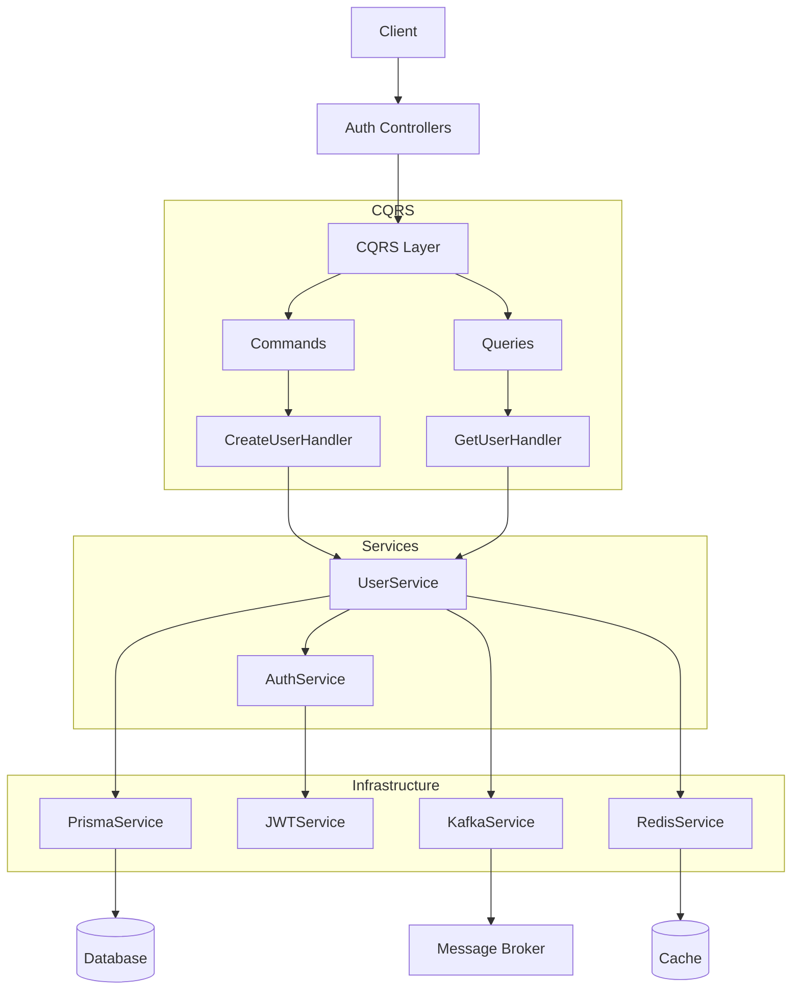
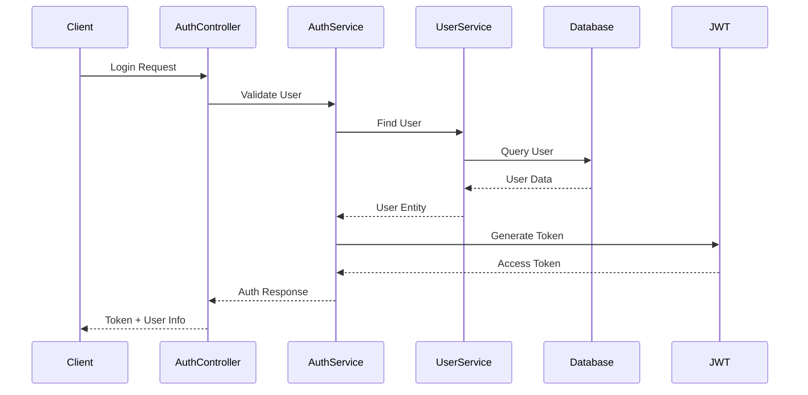
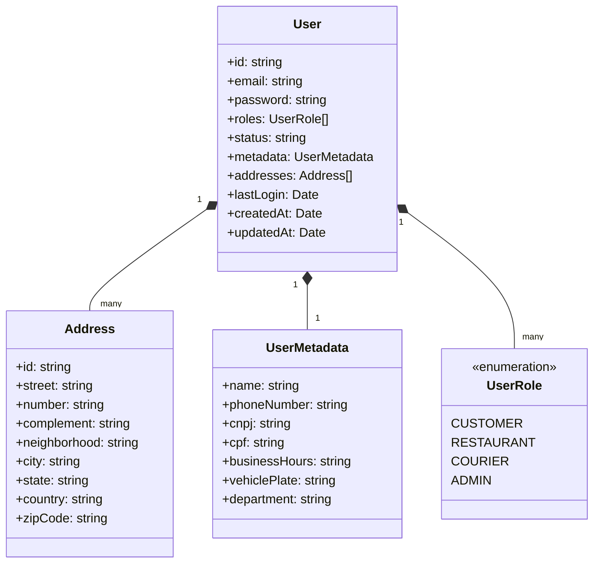

# Overview do Sistema Atual

```mermaid
graph TD
    A[Client] --> B[Auth Controllers]
    B --> C[CQRS Layer]
    
    subgraph CQRS
        C --> D[Commands]
        C --> E[Queries]
        D --> F[CreateUserHandler]
        E --> G[GetUserHandler]
    end
    
    subgraph Services
        F --> H[UserService]
        G --> H
        H --> I[AuthService]
    end
    
    subgraph Infrastructure
        H --> J[PrismaService]
        I --> K[JWTService]
        H --> L[KafkaService]
        H --> M[RedisService]
    end
    
    J --> N[(Database)]
    L --> O[Message Broker]
    M --> P[(Cache)]
```

# Fluxo de Autenticação

```mermaid

sequenceDiagram
    participant Client
    participant AuthController
    participant AuthService
    participant UserService
    participant Database
    participant JWT

    Client->>AuthController: Login Request
    AuthController->>AuthService: Validate User
    AuthService->>UserService: Find User
    UserService->>Database: Query User
    Database-->>UserService: User Data
    UserService-->>AuthService: User Entity
    AuthService->>JWT: Generate Token
    JWT-->>AuthService: Access Token
    AuthService-->>AuthController: Auth Response
    AuthController-->>Client: Token + User Info
```

## Modelo de Domínio

```mermaid
classDiagram
    class User {
        +id: string
        +email: string
        +password: string
        +roles: UserRole[]
        +status: string
        +metadata: UserMetadata
        +addresses: Address[]
        +lastLogin: Date
        +createdAt: Date
        +updatedAt: Date
    }

    class UserRole {
        <<enumeration>>
        CUSTOMER
        RESTAURANT
        COURIER
        ADMIN
    }

    class UserMetadata {
        +name: string
        +phoneNumber: string
        +cnpj: string
        +cpf: string
        +businessHours: string
        +vehiclePlate: string
        +department: string
    }

    class Address {
        +id: string
        +street: string
        +number: string
        +complement: string
        +neighborhood: string
        +city: string
        +state: string
        +country: string
        +zipCode: string
    }

    User "1" *-- "many" Address
    User "1" *-- "1" UserMetadata
    User "1" *-- "many" UserRole
```